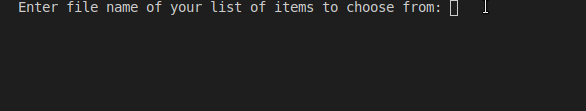

# Chooser

This is a repository of one of my side projects made with Python.
I had no clue what to do next for my portfolio so I searched internet for programming ideas.
When I saw hundreds of different topics I came up with a brilliant idea to create an application
that makes picking choices for you!
It allows you to pick one or more options for list of items with a cool randomization effect.
For now it runs in terminal, loads only one file and allows to pick from 1 do n-1 options to pick.

## How to use it?
Clone this repository or copy-paste code to new file. Make sure you have installed keyboard module with command `pip install keyboard`. To run this application, enter `sudo python3 chooser.py`.
Since this application uses keyboard module, you **have to** run it with sudo permission as it is 
required by keyboard module itself.

## How to create lists to pick options from?
Chooser reads plain text files (txt) that contains:
In first line there is a title you want to be displayed when choice was made
In next lines include your options one per-line.

*Tips:* Try to keep options as short as possible. There is an issue with long strings which breaks application functionality for now.

### Here's how Chooser looks like when running

